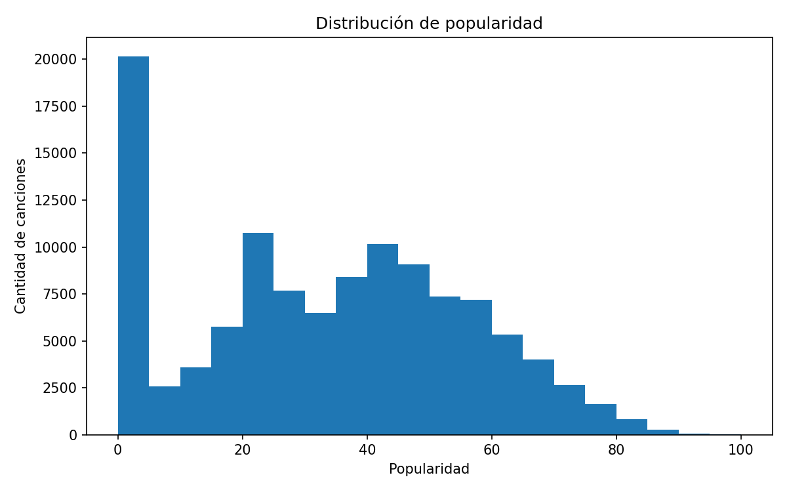
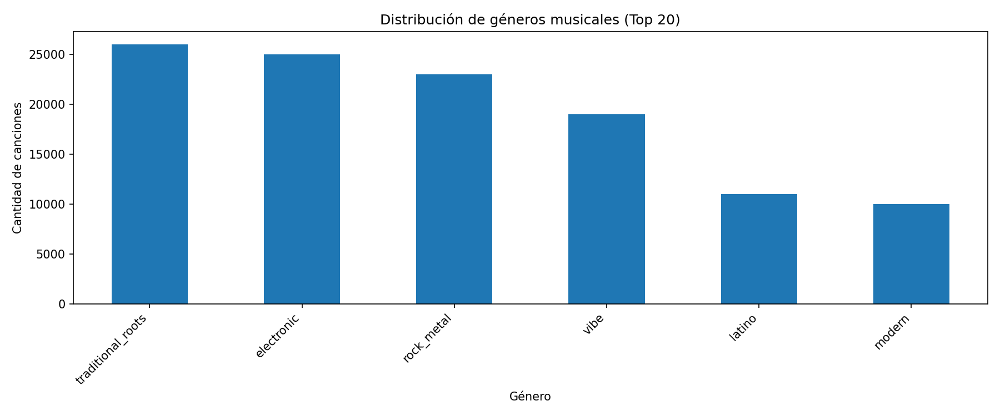
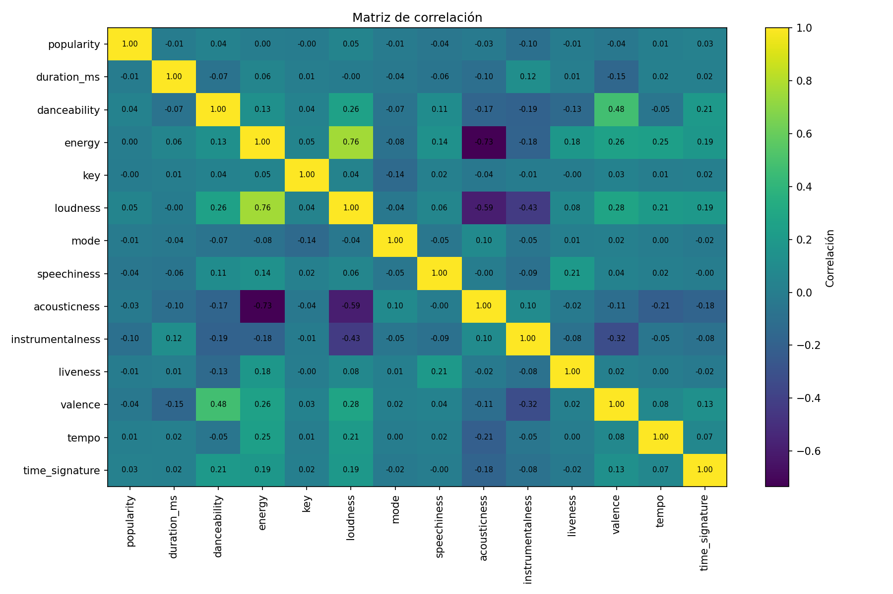
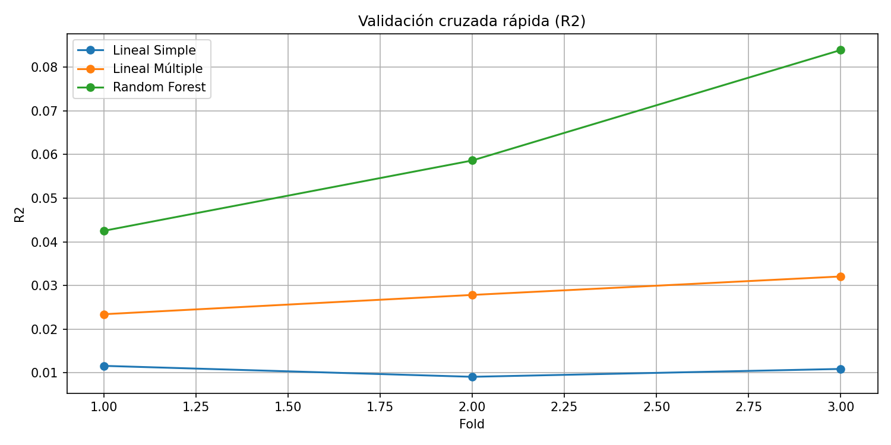
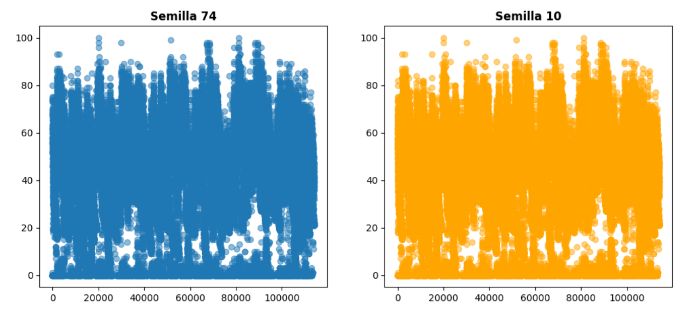
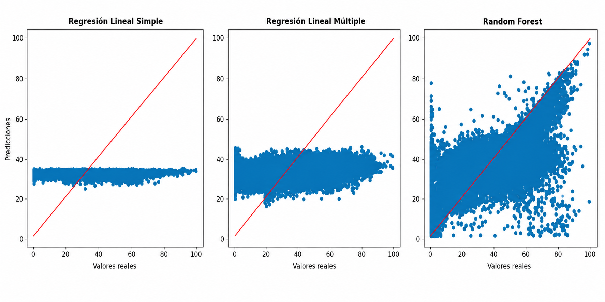

## Modelado de Regresión y Clasificación con Spotify Tracks

En esta tarea se trabajó con el dataset `spotify_tracks.csv` utilizando diferentes técnicas de Machine Learning para analizar y predecir información relacionada con canciones de Spotify.

El proyecto se desarrolló en el notebook:

- `401.ipynb`

## Objetivos de la práctica

Durante la tarea se realizaron diferentes procesos de análisis y modelado:

- Exploración y limpieza del dataset
- Separación de variables predictoras y variables objetivo
- Normalización y preparación de datos
- Análisis descriptivo y correlaciones
- Modelado de regresión para predecir la popularidad de canciones
- Modelado de clasificación para predecir géneros musicales
- Comparación de modelos mediante métricas y validación cruzada
- Visualización de resultados utilizando Matplotlib

## Modelos utilizados

### Regresión
- Regresión Lineal Simple
- Regresión Lineal Múltiple
- Random Forest Regressor

### Clasificación
- Support Vector Machine (SVM)
- Random Forest Classifier

## Librerías utilizadas

- pandas
- numpy
- matplotlib
- seaborn
- scikit-learn

## Dataset

El dataset utilizado contiene más de 114.000 registros de canciones de Spotify con información relacionada con:

- popularidad
- energía
- danceability
- loudness
- tempo
- acousticness
- valence
- géneros musicales
- entre otras características

## Observaciones

Durante la realización de la práctica surgieron algunas dificultades relacionadas con el tamaño del dataset y el tiempo de entrenamiento de algunos modelos, especialmente SVM y Random Forest.

Para mejorar la visualización y comprensión de los resultados también se utilizaron gráficos realizados con Matplotlib.

## Estructura del proyecto

```bash
├── 401.ipynb
├── spotify_tracks.csv
└── README.md

```

# Visualizaciones del proyecto

Gráficas generadas durante el análisis y entrenamiento de modelos del ejercicio `401.ipynb`.

---

## Distribución de popularidad

En esta gráfica se representa cómo se distribuyen los valores de popularidad de las canciones dentro del dataset.

<p align="center">
  
</p>

---

## Distribución de géneros musicales

Gráfico de barras con la frecuencia de aparición de los géneros musicales más comunes del dataset.

<p align="center">
  
</p>

---

## Matriz de correlación

Mapa de calor utilizado para analizar la relación entre las variables numéricas del dataset.

<p align="center">
  
</p>

---

## Validación cruzada de modelos

Comparación del rendimiento de los modelos utilizando validación cruzada y la métrica R2.

<p align="center">
  
</p>

## Comparación de divisiones utilizando diferentes semillas

En esta gráfica se puede observar cómo cambia la distribución de los datos al utilizar distintas semillas aleatorias (`random_state=74` y `random_state=10`) durante la división entre entrenamiento y prueba.

Aunque el tamaño de los conjuntos se mantiene igual, las filas seleccionadas para entrenamiento cambian dependiendo de la semilla utilizada.

<p align="center">
  
</p>


## Comparación de modelos predictivos

En las siguientes gráficas se comparan los valores reales frente a las predicciones obtenidas por cada modelo de regresión.

La línea roja representa la predicción ideal. Cuanto más cerca estén los puntos de esa línea, mejor es el rendimiento del modelo.


<p align="center">
  
</p>

---
